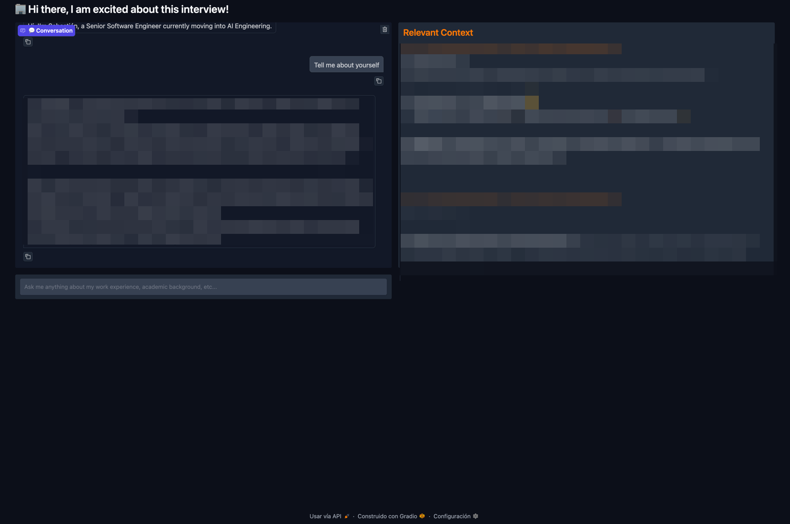
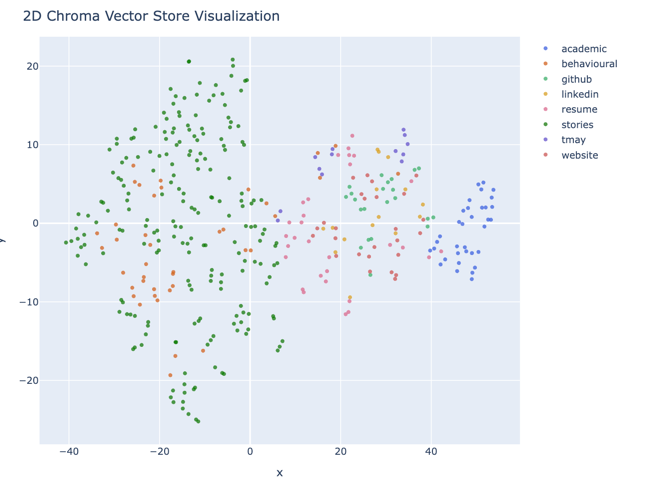
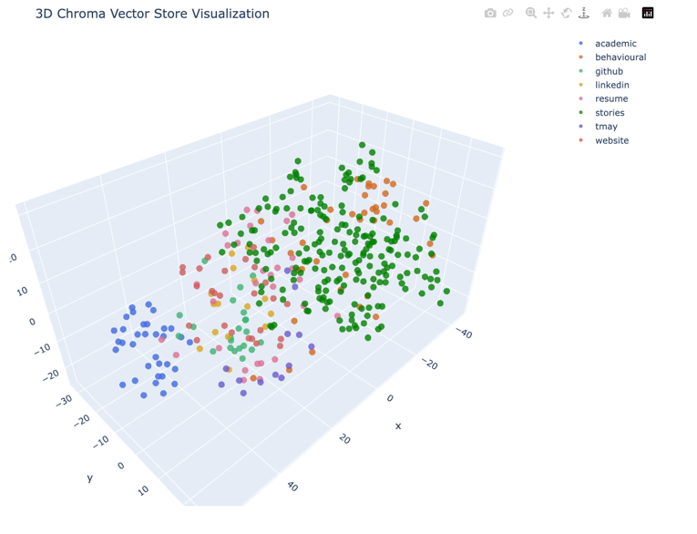
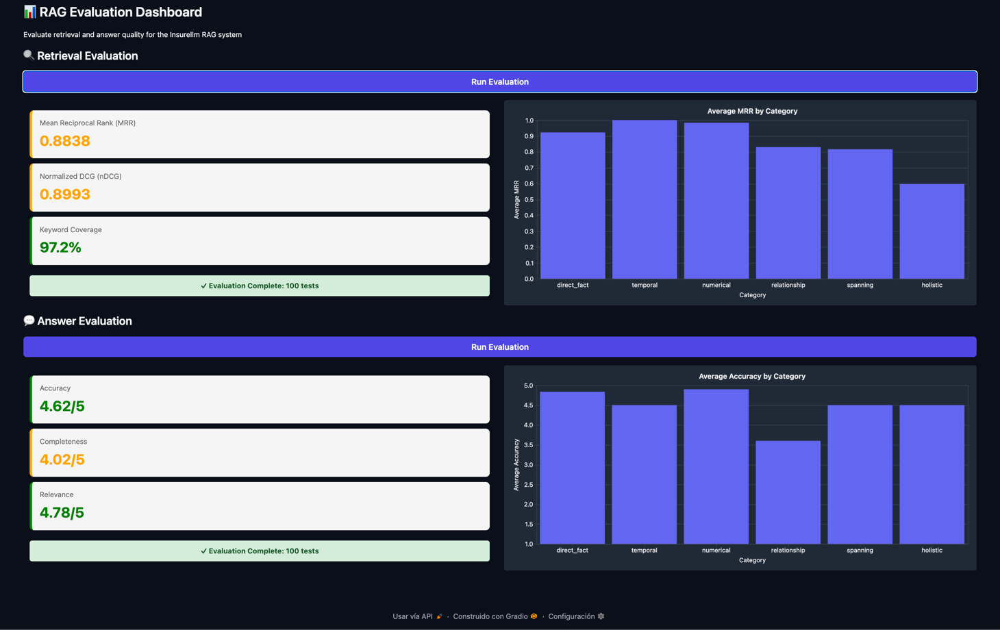

# TMAY Chatbot

**TMAY** ("Tell Me About Yourself") is a RAG chatbot that answers job-interview-style questions about
a person (work experience, education, stories, LinkedIn, GitHub, website, ...) using a personal
knowledge base as its only source of truth.

> **Lab / experimentation project.** This repo is a learning lab, not a production system. It is based on
> the RAG week of the [LLM Engineering course](https://github.com/ed-donner/llm_engineering/tree/main/week5)
> by Ed Donner, extended with two implementations, evaluation tooling and the apps described below.
>
> Author: Sebastian Castañeda.

The repo contains everything around that chatbot:

- an **ingestion pipeline** that chunks the Markdown knowledge base and embeds it into a Chroma vector DB,
- **two chatbot implementations** (`v1` and `v2`) to compare a basic RAG against an advanced one,
- a **Gradio chatbot UI**, a **Gradio evaluation dashboard**, a **CLI evaluator** and a **Plotly embedding visualizer**,
- an **evaluation suite** of 100 questions with keywords and reference answers.

## How it works

```
knowledge-base/*.md ──► ingestor (chunking) ──► embeddings ──► Chroma (vector_db/)
                                                                     │
user question ──► chatbot (retrieval [+ rewrite + rerank]) ◄─────────┘
                        │
                        └─► LLM with retrieved context ──► answer
```

The knowledge base lives in `knowledge-base/` as Markdown files (resume, LinkedIn, academic background,
STAR-style stories, behavioural answers, website data, ...). The author's knowledge base contains
personal data and is not published, so to run the project you need to provide your own documents there and
write your own `tmay_chatbot/evaluation/tests.jsonl`.

## The two implementations

Selected with the `version` setting (default `v2`, see [Configuration](#configuration)). The ingestor
and the chatbot must use the same version, so **re-run `make ingest` after switching**.

| | v1 – basic | v2 – advanced |
|---|---|---|
| **Ingestion** | `RecursiveCharacterTextSplitter` chunks | An LLM splits each document into overlapping chunks, each with a headline, a summary and the original text |
| **Query** | All the user's messages concatenated | The LLM rewrites the question into a short standalone query using the chat history |
| **Retrieval** | Top 10 chunks for the combined question | Top 20 for the original question **and** top 20 for the rewritten one, merged and de-duplicated |
| **Reranking** | None | LLM reranks the merged chunks; the best 10 are used |
| **Code** | `chatbot/v1.py`, `ingestor/v1.py` (LangChain + `ChatOpenAI`) | `chatbot/v2.py`, `ingestor/v2.py` (LiteLLM, structured outputs) |

## Apps

All apps live in `tmay_chatbot/app/` and are launched through the Makefile.

| App | Path | What it does |
|---|---|---|
| Ingestor (CLI) | `app/cli/ingestor.py` | Chunks and embeds `knowledge-base/` into the vector DB using the configured version |
| Chatbot (Gradio) | `app/gradio/chatbot.py` | Chat UI; shows the retrieved context and sources next to the conversation |
| Evaluator (Gradio) | `app/gradio/evaluator.py` | Dashboard that runs retrieval and answer evaluation over all tests |
| Evaluator (CLI) | `app/cli/evaluator.py` | Runs a single test and prints retrieval metrics, the generated answer, judge feedback and scores |
| Visualizer (Plotly) | `app/plotly/visualizer.py` | t-SNE projection of the knowledge-base embeddings, coloured by document type |

### Chatbot

`make chatbot` opens the conversation on the left and the chunks retrieved for the last answer, with their
sources, on the right (personal content blurred in this screenshot).



### Embedding visualizer

`make visualize` projects the chunk embeddings with t-SNE and colours them by document type, in 2D and 3D.
It is useful to see how the knowledge base clusters and whether related documents end up close together.





## Evaluation

Tests are in `tmay_chatbot/evaluation/tests.jsonl` (100 rows). Each one has a `question`, `keywords`, a
`reference_answer` and a `category` (`direct_fact`, `temporal`, `numerical`, `relationship`,
`spanning`, `holistic`).

**Retrieval** (per keyword, averaged per test):
- **MRR** – Mean Reciprocal Rank of the first retrieved chunk containing the keyword
- **nDCG** – ranking quality over the retrieved chunks
- **Keyword coverage** – share of keywords found in the retrieved chunks

**Answer** (LLM-as-a-judge, `eval_model`, scored 1–5 against the reference answer):
- **Accuracy**, **Completeness**, **Relevance**

Run it from the dashboard (`make evaluator`) or one test at a time (`make evaluate N=3`).

### Example

Evaluation dashboard running the v2 implementation over the 100 tests:



## Getting started

Requirements: Python 3.11+, [uv](https://docs.astral.sh/uv/) and an OpenAI API key.

```bash
make sync                      # install dependencies
echo "OPENAI_API_KEY=sk-..." > .env
make ingest                    # build the vector DB
make chatbot                   # chat at the printed local URL
```

## Make commands

Run `make` (or `make help`) to list them.

| Command | Description |
|---|---|
| `make sync` | Install/update dependencies from `uv.lock` |
| `make ingest` | Chunk and embed `knowledge-base/` into the vector DB |
| `make chatbot` | Launch the chatbot Gradio app |
| `make evaluator` | Launch the evaluator Gradio dashboard |
| `make evaluate N=<row>` | Run a single evaluation test row (0-based), e.g. `make evaluate N=3` |
| `make visualize` | Visualize knowledge-base embeddings with Plotly |
| `make lint` | Check code with ruff (no changes) |
| `make format` | Format code with ruff |
| `make imports` | Sort imports and remove unused ones with ruff |
| `make fix` | Auto-fix lint issues (incl. imports) and format code |

## Using your own knowledge base

The chatbot only knows what is in `knowledge-base/`, so to make it talk about you (or anyone else):

1. **Create the folders.** Each sub-folder of `knowledge-base/` is a *document type*, and every `*.md`
   file inside it (recursively) is loaded. The folder name is stored as metadata, passed to the v2 LLM
   chunker and used to colour the Plotly visualizer. Use whatever grouping suits you, for example:

   ```
   knowledge-base/
   ├── resume/        resume.md
   ├── linkedin/      profile.md
   ├── academic/      degrees, courses, certifications
   ├── stories/       one file per STAR-style story
   ├── behavioural/   answers to common interview questions
   └── website/       content from your personal site
   ```

   Files placed directly in `knowledge-base/` (outside a sub-folder) are ignored.

2. **Write plain Markdown.** Keep one topic per file and be explicit: include dates, company names,
   roles, numbers and outcomes, since those are what questions will ask about. Stories work best with
   headings such as Context / Actions / Result.
   The only other file formats supported are the ones you convert yourself. To turn a PDF (e.g. your
   resume) into Markdown:

   ```bash
   uv run python -c "from tmay_chatbot.utils.pdf_to_markdown import pdf_to_markdown; pdf_to_markdown('resume.pdf', 'knowledge-base/resume/resume.md')"
   ```

   Review the output by hand, as PDF extraction is rarely perfect.

3. **Adapt the prompts.** The chatbot persona lives in `SYSTEM_PROMPT` in `tmay_chatbot/chatbot/base.py`
   (a candidate in a job interview, English and Spanish only), and the v2 chunker prompt in
   `tmay_chatbot/core/chunking/llm_chunker.py` mentions the kind of material expected. Edit both if
   your use case differs.

4. **Re-ingest.** The vector DB is not updated automatically. Run `make ingest` after every change to
   the knowledge base (and after switching `version`).

5. **Write your own tests** in `tmay_chatbot/evaluation/tests.jsonl`, one JSON object per line
   (or point `tests_path` somewhere else):

   ```json
   {"question": "Where did you study?", "keywords": ["UDA", "Computer Science"], "reference_answer": "I studied Computer Science at UDA.", "category": "direct_fact"}
   ```

   - `keywords` must be strings that should appear verbatim in the retrieved chunks; they drive the
     MRR, nDCG and coverage metrics.
   - `reference_answer` is what the LLM judge compares the generated answer with.
   - `category` is free text; the dashboard groups its charts by it.

6. **Check it.** Run `make evaluate N=0` to try a single test, then `make chatbot` to chat and inspect
   the retrieved context.

## Configuration

Settings are defined in `tmay_chatbot/settings.py` and can be overridden with environment variables or
a `.env` file at the repo root.

| Setting | Default | Purpose |
|---|---|---|
| `version` | `v2` | Ingestor and chatbot implementation (`v1` or `v2`) |
| `chat_model` | `gpt-5.1` | Model that answers (and rewrites/reranks in v2) |
| `embedding_model` | `openai:text-embedding-3-large` | Embedding model |
| `chunking_model` | `gpt-4.1` | Model used by the v2 LLM chunker |
| `eval_model` | `gpt-4.1-nano` | LLM judge for answer evaluation |
| `knowledge_base_path` | `knowledge-base/` | Source Markdown documents |
| `vector_db_path` | `vector_db/` | Chroma persistence directory (git-ignored) |
| `collection_name` | `tmay` | Chroma collection |
| `tests_path` | `tmay_chatbot/evaluation/tests.jsonl` | Evaluation questions |
